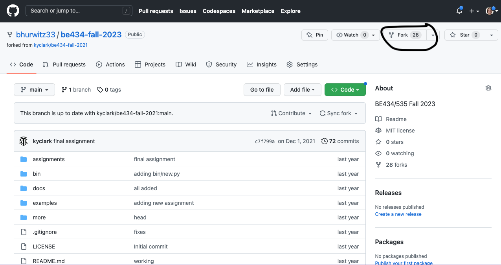
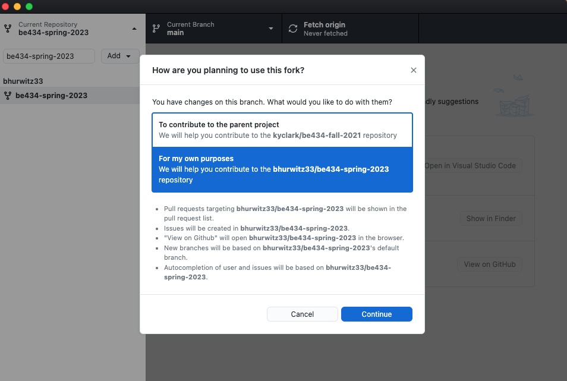
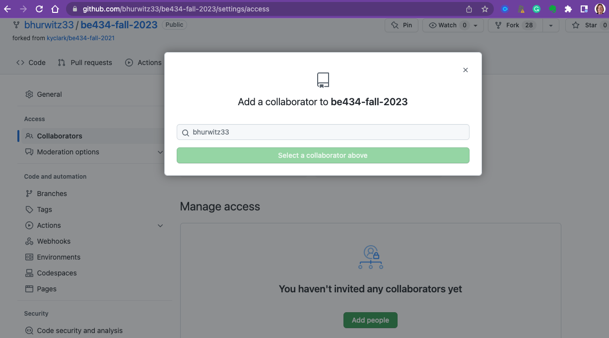
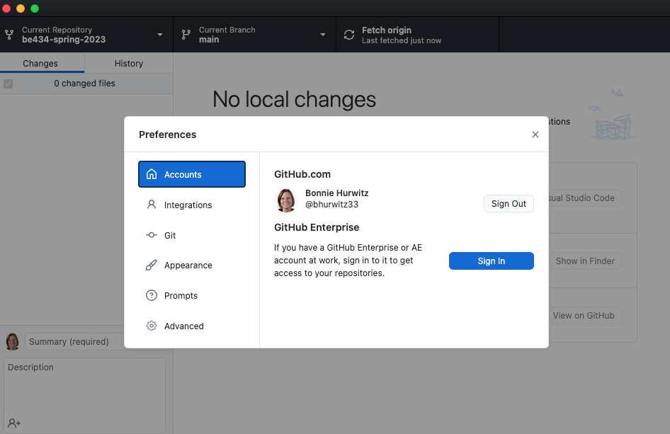
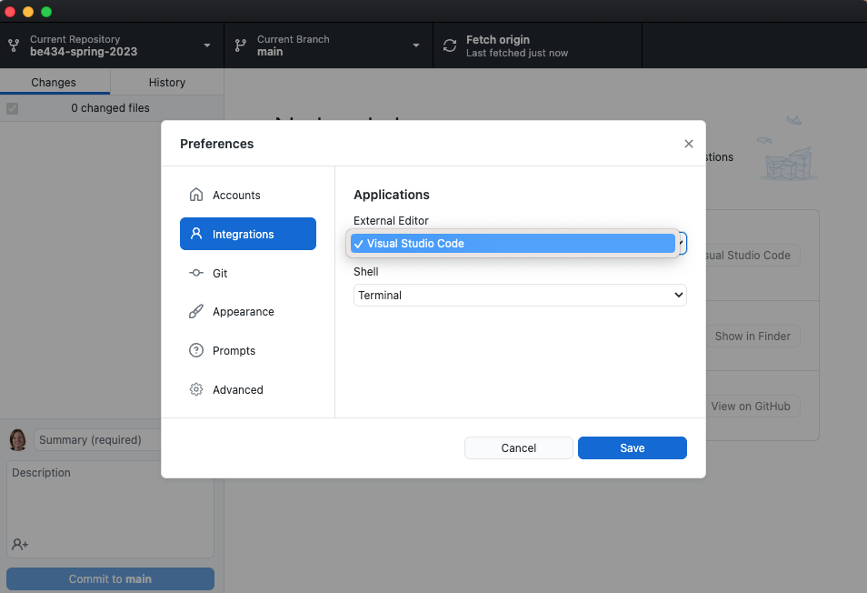
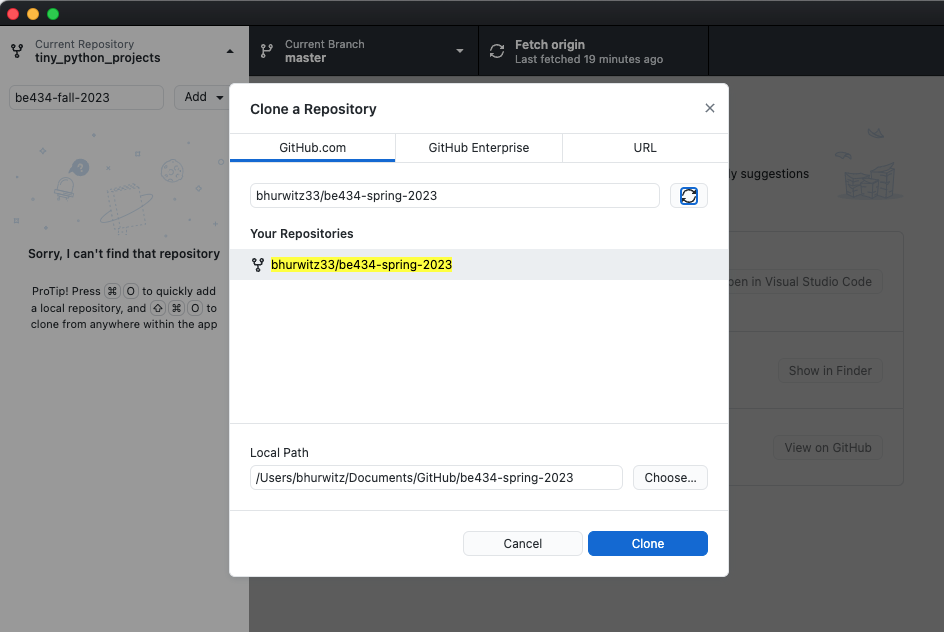
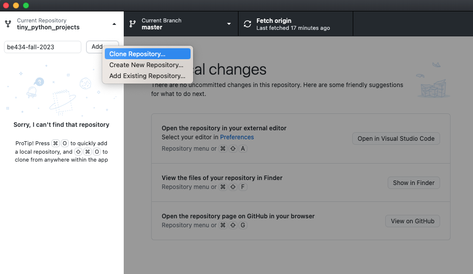

# Task 4: Getting started with Github

All of the homework assignments for this class will be submitted using GitHub, a freely available code repository. GitHub allows programmers to share and collaboratively write code together. It also allows users to track changes they make in their code and revert back to older versions if needed. As part of this class you will share your code with me (your instructor Bonnie Hurwitz) so that I can grade your assignments. If you get stuck you can also "push" your code to Github and I can point out errors or mistakes for you to fix.

Also, all of the course materials are available to you in a GitHub repository. Below, you will learn how to make a copy of this repository and use it for writing code and turning in homework assignments. 

## Creating a GitHub account

The following will help you create a GitHub account and copy the course repository into your own account.
This will allow you to have your own copy of the assignments, a place to write programs, and a repository in Github that you can submit your assignments to.  

First, create your free [GitHub](http://github.com) account 

* Go to [GitHub](http://github.com)
* Create a (free) user account

## Copy the course repository to your own GitHub account.

Next, go to the [course repository](https://github.com/bhurwitz33/be434-spring-2023) and click the "Fork" button so as to make a copy of the code into your own Github account. 

* Go to [the course repo](https://github.com/bhurwitz33/be434-spring-2023)
* Click the "Fork" button (upper-right)
* Indicate that you will use it for personal reasons

This will create a new repository in your Github account. 

## Share your "copy" of the course repository with the instructor

All your assignments will be pushed to GitHub where I will pull the code to my machine for checking and grading. Add my GitHub username "bhurwitz33" as a Collaborator on your repo so that I can push and pull code, and then email me your GitHub username and the URL for your repo (bhurwitz@arizona.edu). At the end of the semester, you will have a public repository of code you can share to show proficiency in Python coding and testing. 

* Go to the "Settings" for your repo called "be434-spring-2023"
* Choose "Manage Access" from the left panel
* Click the green "Invite a collaborator" button
* Add "bhurwitz33" and send

## Download your GitHub course repository to your laptop where you can work on python code locally

Next, you will need to create a copy of this repository on your laptop so you can work on python code locally, and then turn it in by pushing the code back to Github (more on this next). I recommend using [the Github Desktop](https://desktop.github.com/)

* Download [the Github Desktop](https://desktop.github.com/) for your laptop
* From the top menu bar, select Github Desktop, then select Preferences, go to Accounts, and login to Github
* From the top menu bar, select Github Desktop, then select Preferences, go to Integrations, select Visual Studio Code as the "External Editor"
* Be sure to "save" your Preferences

With that, you now should be able _clone_ or copy down the contents of the repo onto your local machine (e.g., your laptop). 

* Using GitHub desktop, Go to File in the top menu, and select "Clone Repository"
* Use the "Filter your repositories" box to find "be434-spring-2023" in your GitHub Account
* Select the "be434-spring-2023" and click the "Clone" button to copy the repository to your local directory

Now that you have your first Github account and repository created, you can push and pull to/from your web-based GitHub repository and your computer. This is similar to Google drive where you might have a copy of a file locally on your computer, and also a copy that you uploaded to Google Drive. The main difference is that these files are connected, so GitHub knows that a file is new or modified on your laptop compared to what you have in your web-based GitHub repository.

## Authors

Bonnie Hurwitz <bhurwitz@arizona.edu> and Ken Youens-Clark <kyclark@gmail.com>

